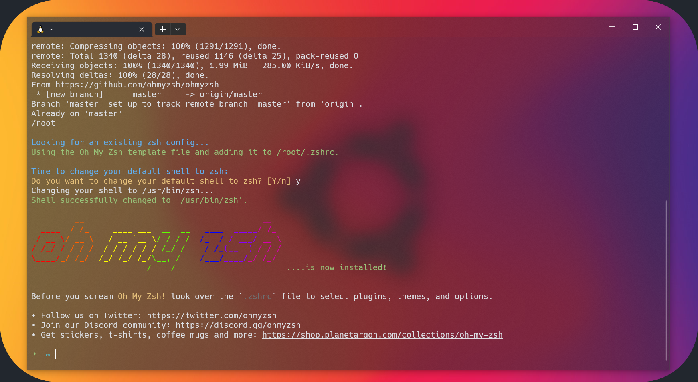
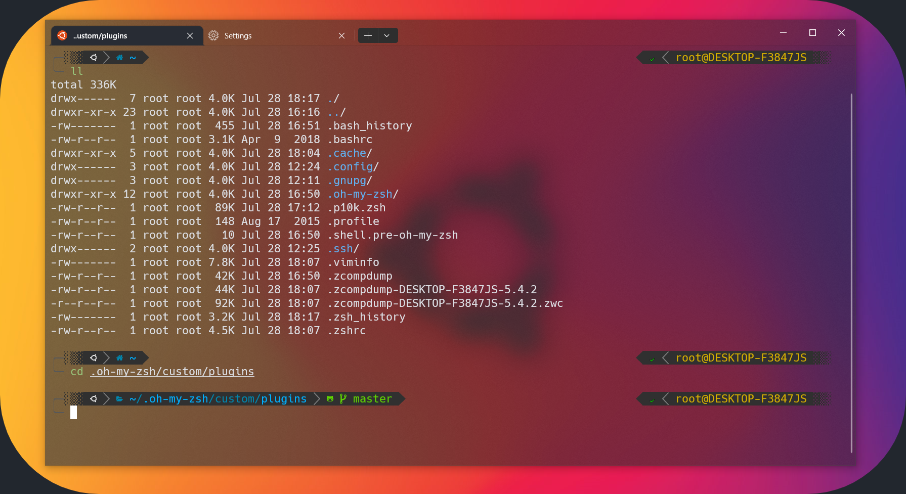

# Make Your WSL OR WSL2 Terminal AWESOME - With Windows Terminal , ZSH , Oh-My-Zsh And Powerlevel10k



# Prerequisites

- Windows Subsystem for Linux, running on Windows 10 or newer

# Installation and Configuration

## Install Windows Terminal

https://docs.microsoft.com/en-us/windows/terminal/install

## Install Nerd Fonts

To make Windows Terminal able to render the icons we're using in **zsh** later, we need to install the **Nerd-Fonts** on Windows. First, go to the Nerd-Font homepage and select a Font you like. Note that not all of them work well with all zsh themes, you may need to try out different ones. Fonts that work for me are **Anonymice Nerd Font**, **Droid Sans Mono Nerd Font**, and **Hack Nerd Font**. Then, extract the archive and install all of the `.otf` Font files.

https://www.nerdfonts.com/

## Install ZSH Shell in WSL / WSL2

Now we need to install the **zsh** shell in our wsl or wsl2. You can easily install it in the Ubuntu wsl by using the commands below. If you're using a different Linux distribution, you may check out the zsh documentation or your package a documentation.

We will also install **oh-my-zsh** which is a nice configuration extension to the **zsh** shell. That will allow us to easily customize anything, install a theme, and add plugins later.

```bash
sudo apt-get update && apt-get upgrade -y

sudo apt install git zsh -y

```


```bash
sh -c "$(curl -fsSL https://raw.github.com/ohmyzsh/ohmyzsh/master/tools/install.sh)"
```


## Install powerlevel10k ZSH Theme

Next, we will install the powerlevel10k theme, which really looks nice and offers great customization features. It also has a good configuration wizard that makes it extremely easy to set up the theme for your favorite design.

```bash
git clone --depth=1 https://github.com/romkatv/powerlevel10k.git ${ZSH_CUSTOM:-~/.oh-my-zsh/custom}/themes/powerlevel10k
```

- To activate the theme you need to edit your `~/.zshrc` file in your personal folder.

```bash
vi .zshrc
```
  
And 
activate `#zstyle ':omz:update' mode reminder` removing `#`
activate `#HIST_STAMPS="mm/dd/yyyy` removing `#`
replace `ZSH_THEME="robbyrussel` with `ZSH_THEME="powerlevel10k/powerlevel10k`. After the change, you need to close and restart your terminal.

## Change Windows Terminal settings to use Nerd-Fonts

Because we want Windows Terminal to be able to render the icons in the powerlevel10k theme correctly, 
We need to change the Windows Terminal configuration to use the Nerd-Font we've downloaded before. 
Click on **Settings** in the Windows Terminal menu and select profile **Defaults** . 
Then in **Additional Settings** , Go to **Appearance** and select the font face that you are installed From Nerd-Fonts.





## (Optional) How to Install or Enable Plugins in ZSH

**Example: Auto-Suggestion Plugin**

```bash
git clone https://github.com/zsh-users/zsh-autosuggestions ${ZSH_CUSTOM:-~/.oh-my-zsh/custom}/plugins/zsh-autosuggestions
```

**Example: Syntax-Highlighting Plugin**

```bash
git clone https://github.com/zsh-users/zsh-syntax-highlighting ${ZSH_CUSTOM:-~/.oh-my-zsh/custom}/plugins/zsh-syntax-highlighting
```

To enable the auto-suggestion and syntax-highlighting plugins or any other plugins in home directory, edit your `~/.zshrc` file. 

```bash
vi .zshrc

```
Simply change the default line `plugins=(git)` to `plugins=(git sudo <optional-other-plugins>)`.

And

- Copy and Replace These Three Lines under the `plugins=(git sudo <optional-other-plugins>)`

  
```bash
source $ZSH/oh-my-zsh.sh

source $ZSH_CUSTOM/plugins/zsh-autosuggestions/zsh-autosuggestions.zsh

source $ZSH_CUSTOM/plugins/zsh-syntax-highlighting/zsh-syntax-highlighting.zsh
```
<br>

# 💰 You can help me by Donating


<a href="https://buymeacoffee.com/pasinduljay" target="_blank"></a>
<a href="https://paypal.me/980822" target="_blank">
<br><br>
